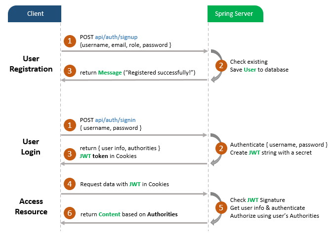
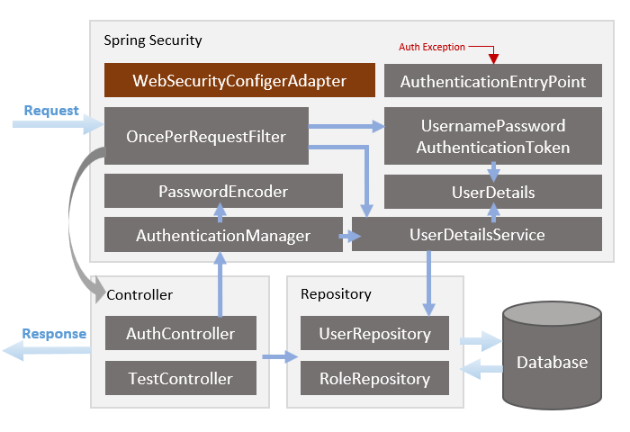

# Desafío con Spring Boot, Spring Security, PostgreSQL and JWT.

## Ejecución 

- git clone https://github.com/guillermotunez/spring-boot-security-jwt.git
- cd spring-boot-security-jwt
- ./mvnw clean package 
- ./compose-up.sh
- usar la colección de Postman para probar las diferentes funcionalidades.
- ./compose-down.sh

## User Sing Up, Login and Authorization process.

## Spring Boot Server Architecture with Spring Security.

